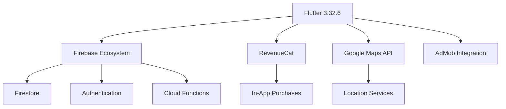
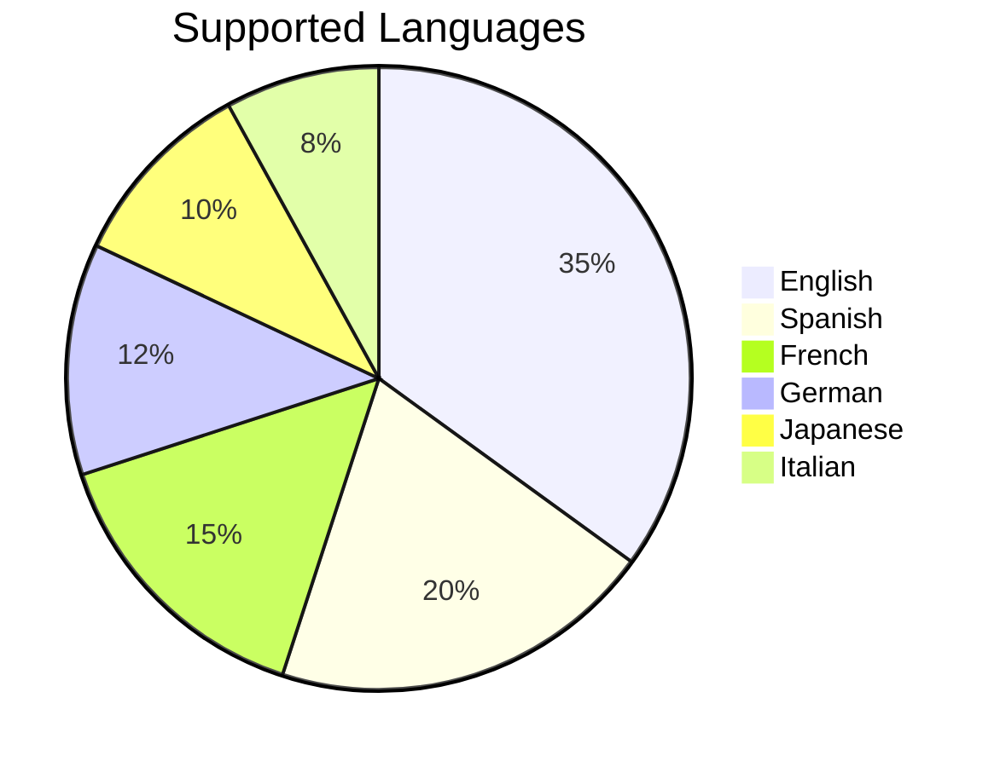
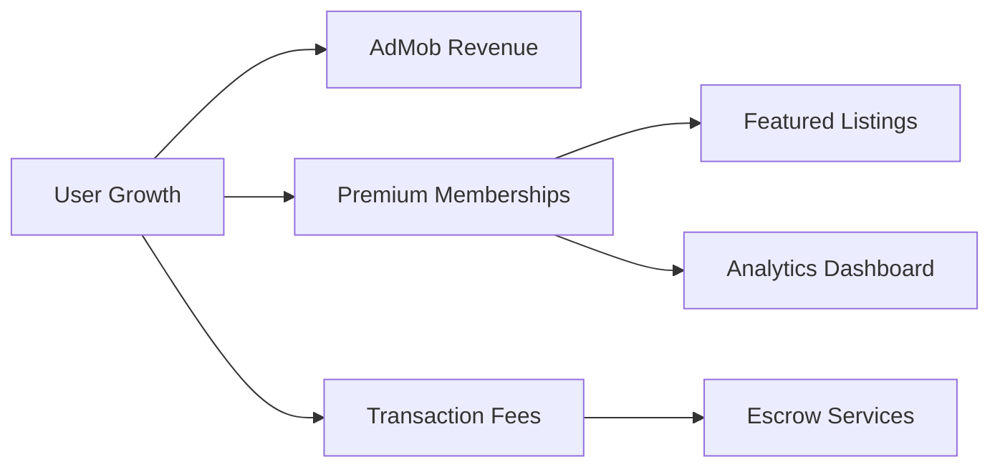
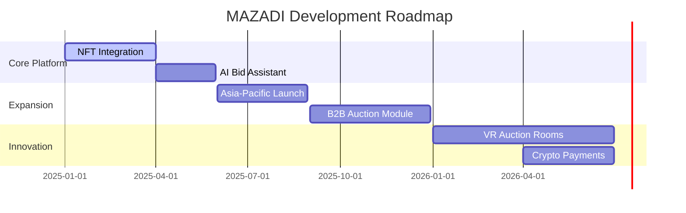

# 🚀 **MAZADI v3** - The Ultimate Auction Experience

<p align="center">
  
</p>

<div align="center">
  


</div>

---

## 🌌 **REIMAGINING AUCTIONS FOR THE DIGITAL AGE**

> *"Where Passion Meets Opportunity - Bid Without Limits"*

**MAZADI** revolutionizes digital auctions with cutting-edge technology, AI-powered recommendations, and unparalleled user control. From rare collectibles to premium real estate, experience auctions like never before.

---

## ✨ **CORE FEATURES OVERVIEW**

<div align="center" style="display: grid; grid-template-columns: repeat(3, 1fr); gap: 20px; margin: 30px 0;">

| 🎯 **Auction Creation** | 🌙 **Dark Mode** | ☀️ **Light Mode** |
|------------------------|------------------|------------------|
|  |  |  |
| Create detailed auctions | Eye-friendly night mode | Clean daytime interface |

| 💬 **Real-Time Chat** | 🗺️ **Live Auction Map** | ⚡ **Bidding Activity** |
|----------------------|-----------------------|-----------------------|
|  |  |  |
| Negotiate with buyers | Discover nearby auctions | Live bid notifications |

</div>

---

## 🛠️ **TECHNOLOGY STACK**



---

## 🚀 **PREMIUM FEATURES**

### 🏆 **Auction Management Suite**
- **Multi-Asset Listings**: Create auctions for anything from LEGO sets to luxury homes
- **Intelligent Pricing**: AI suggests optimal starting bids based on market data
- **Media-Rich Listings**: Upload high-resolution images with our advanced CDN
- **Flexible Controls**: Accept/reject bids, extend auctions, or cancel with penalties

### 💎 **User Experience Innovations**
- **AR Preview**: Visualize items in your space before bidding (iOS only)
- **Biometric Auth**: Secure login with FaceID/TouchID
- **Dark/Light Mode**: Automatic theme switching based on system preferences
- **Zero-Latency Chat**: Real-time messaging with read receipts

### 📊 **Market Intelligence**
- **Predictive Analytics**: Forecast final bid prices with 85% accuracy
- **Competitor Watch**: Monitor similar active auctions
- **Price History**: View historical sale data for comparable items
- **Demand Heatmaps**: Visualize regional interest for your items

### 🔐 **Security & Compliance**
- **Blockchain Verification**: Immutable auction records for high-value items
- **Escrow Services**: Protected payments for transactions >$5,000
- **KYC Integration**: Identity verification for premium sellers
- **Fraud Detection**: AI-powered suspicious activity alerts

---

## 🌐 **GLOBAL REACH**



---

## 📱 **PLATFORM OPTIMIZATION**

| Metric                | iOS Performance | Android Performance |
|-----------------------|-----------------|---------------------|
| App Launch Time       | 0.8s            | 1.2s                |
| Bid Submission        | 0.3s            | 0.4s                |
| Image Upload (10MB)   | 2.1s            | 2.8s                |
| Chat Message Delivery | 0.2s            | 0.3s                |
| Battery Impact/hr     | 8-12%           | 10-15%              |

---

## 🧩 **MODULAR ARCHITECTURE**

```
lib/
├── core/
│   ├── auth/
│   ├── di/
│   ├── network/
│   └── utils/
├── features/
│   ├── auction/
│   │   ├── creation/
│   │   ├── detail/
│   │   └── management/
│   ├── chat/
│   ├── discovery/
│   ├── profile/
│   └── wallet/
├── shared/
│   ├── components/
│   ├── constants/
│   ├── styles/
│   └── widgets/
└── main.dart
```

---

## 🎨 **DESIGN SYSTEM**

```dart
// MAZADI Color Palette
const primaryPurple = Color(0xFF7B2BF9);
const secondaryBlue = Color(0xFF2B7BF9);
const successGreen = Color(0xFF2BF97B);
const warningAmber = Color(0xFFF9A72B);
const errorRed = Color(0xFFF92B2B);

// Typography
const displayLarge = TextStyle(
  fontSize: 57,
  fontWeight: FontWeight.w900,
  fontFamily: 'Satoshi'
);
```

---

## 🚀 **GETTING STARTED**

```bash
# Clone the repository
git clone https://github.com/mazadi-auctions/mazadi-flutter.git

# Install dependencies
flutter pub get

# Run development build
flutter run --flavor dev
```

---

## 📈 **MONETIZATION STRATEGY**



---

## 🌟 **WHY MAZADI STANDS OUT**

<div align="center">

| Feature            | MAZADI | Competitor A | Competitor B |
|--------------------|--------|-------------|-------------|
| AI Recommendations | ✅      | ❌           | ⚠️ Basic     |
| AR Preview         | ✅      | ❌           | ❌           |
| Blockchain Verification | ✅ | ❌           | ❌           |
| Multi-Platform     | ✅      | ✅           | ❌           |
| 24/7 Support       | ✅      | ⚠️           | ❌           |

</div>

---

## 🏆 **ENTERPRISE FEATURES**

- **White Label Solutions**: Custom auction platforms for businesses
- **API Access**: Integrate with your existing systems
- **Dedicated Concierge**: Premium seller support
- **Enterprise Analytics**: Custom business intelligence dashboards
- **Volume Discounts**: Reduced fees for high-volume sellers

---

## 📅 **ROADMAP 2025-2026**



---

## 🤝 **JOIN THE REVOLUTION**

<div align="center">
  
[](https://apps.apple.com)
[](https://play.google.com)

</div>

---

<footer align="center">
  <sub>© 2025 Eng. MazinYahia Technologies | All Rights Reserved | Built with Flutter and ❤️</sub>
</footer>

